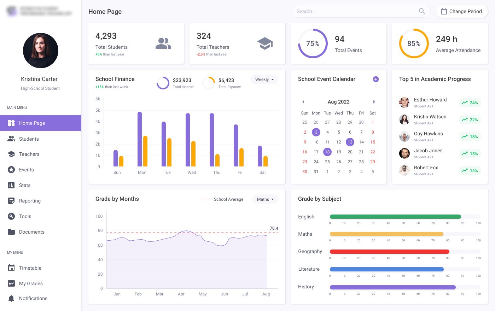
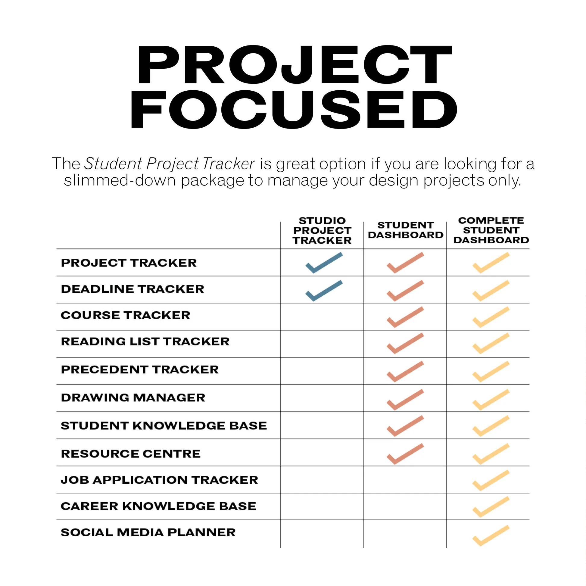
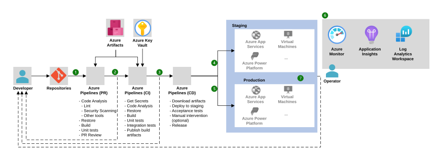

<p align="center">
  
</p>

---

<p align="center">
  
</p>

---

<p align="center">
  
  
  
  
  
  <br/>
  
  
  
</p>

---

# 📘 **Student Project Tracker – CI/CD Automated Deployment (Jenkins + Docker)**

A clean and powerful student project tracking system with a fully automated CI/CD pipeline using **Jenkins**, **Docker**, and **GitHub**.

---

## 🚀 **Overview**

The **Student Project Tracker** helps students manage academic projects, deadlines, and progress in one place.
Backend is built with **Node.js**, frontend is a simple **HTML dashboard**, and CI/CD pipeline automates:

* 🔄 Code integration
* 🐳 Docker image builds
* 🚚 Deployment-ready artifacts generation
* 📦 Frontend static file archiving

---

## 🎨 **Project UI Preview**

> *(Add your images into an `img/` folder before pushing to GitHub)*

### 📊 Dashboard Sample



### 📘 Project Focus Overview



---

## ⚙️ **Architecture – CI/CD Pipeline Flow**


### 🔁 CI/CD Full Pipeline Diagram



---

## 🛠️ **Tech Stack**

### **Frontend**

* HTML5
* CSS3 (Static dashboard)

### **Backend**

* Node.js
* Express.js

### **DevOps / Automation**

* Jenkins Pipeline
* Docker
* GitHub SCM

---

## 🧱 **Folder Structure**

```
student-project-tracker/
│
├── backend/
│   ├── routes/
│   ├── server.js
│   ├── package.json
│   ├── Dockerfile
│
├── frontend/
│   ├── index.html
│
├── docs/
│   ├── Doc-Window.md
│   ├── Doc-Ubuntu.md
│
└── Jenkinsfile
```

---

# 🧪 **CI/CD Pipeline Breakdown**

### ✔️ **1. Developer pushes code to GitHub**

Triggers Jenkins automatically.

### ✔️ **2. Jenkins clones repository**

Pulls latest commit from `main`.

### ✔️ **3. Installs Backend dependencies**

Runs:

```
npm install
```

### ✔️ **4. Builds Docker image**

Backend Dockerfile:

```
docker build -t student-backend .
```

### ✔️ **5. Archives frontend static HTML**

Uploads `index.html` as Jenkins artifact.

---

# 🐳 **Backend Dockerfile**

```dockerfile
FROM node:18

WORKDIR /app

COPY package*.json ./

RUN npm install

COPY . .

EXPOSE 3000

CMD ["node", "server.js"]
```

---

# 🔧 **Jenkins Pipeline Script**

```groovy
pipeline {
    agent any

    tools {
        nodejs "node18"
    }

    stages {

        stage('Clone Repository') {
            steps {
                git branch: 'main', url: 'https://github.com/sahilshaikh867/student-project-tracker.git'
            }
        }

        stage('Install Backend Dependencies') {
            steps {
                dir('backend') {
                    bat "npm install"
                }
            }
        }

        stage('Build Backend Docker Image') {
            steps {
                dir('backend') {
                    bat "docker build -t student-backend ."
                }
            }
        }

        stage('Archive Frontend Static Files') {
            steps {
                archiveArtifacts artifacts: 'frontend/index.html', onlyIfSuccessful: true
            }
        }
    }

    post {
        success {
            echo "🎉 Pipeline execution completed successfully!"
        }
        failure {
            echo "❌ Pipeline failed — check logs."
        }
    }
}
```

---

# 💻 **Local Development Setup**

### ▶️ **Backend Start**

```
cd backend
npm install
npm start
```

Runs on: **[http://localhost:3000](http://localhost:3000)**

### 🌐 **Frontend Preview**

Simply open:

```
frontend/index.html
```

in browser.

---

# ☁️ **Future Enhancements**

* Add full React frontend
* Deploy on AWS EC2 / Docker Hub
* Add MongoDB
* Add JWT auth
* Deploy via Kubernetes

---

# ❤️ **Author**

**Sahil Husen Shaikh**
Student Engineer | DevOps Learner

---

<p align="center">
  
  
  
</p>

---

# 📌 **Star the Repo!** ⭐

If this helped you, **drop a star on GitHub**, makes the project look solid ✨

---

